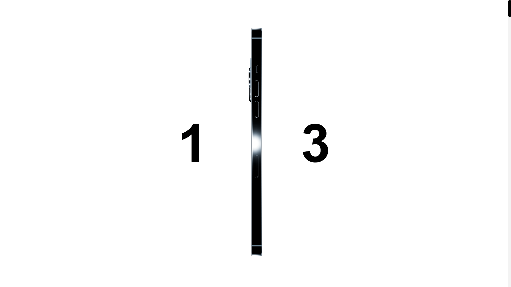
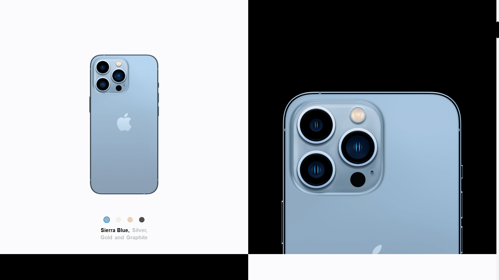
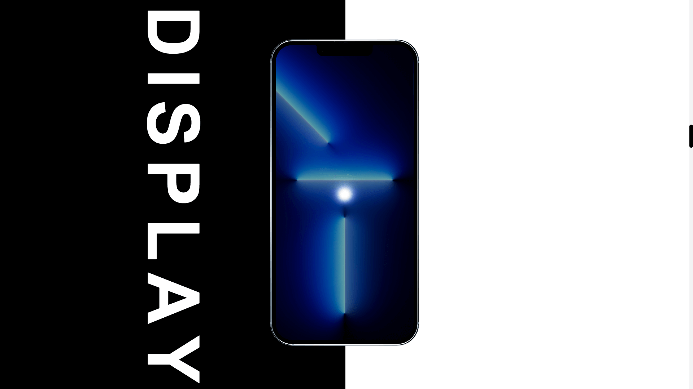
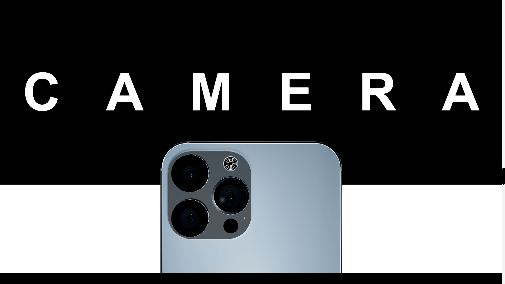
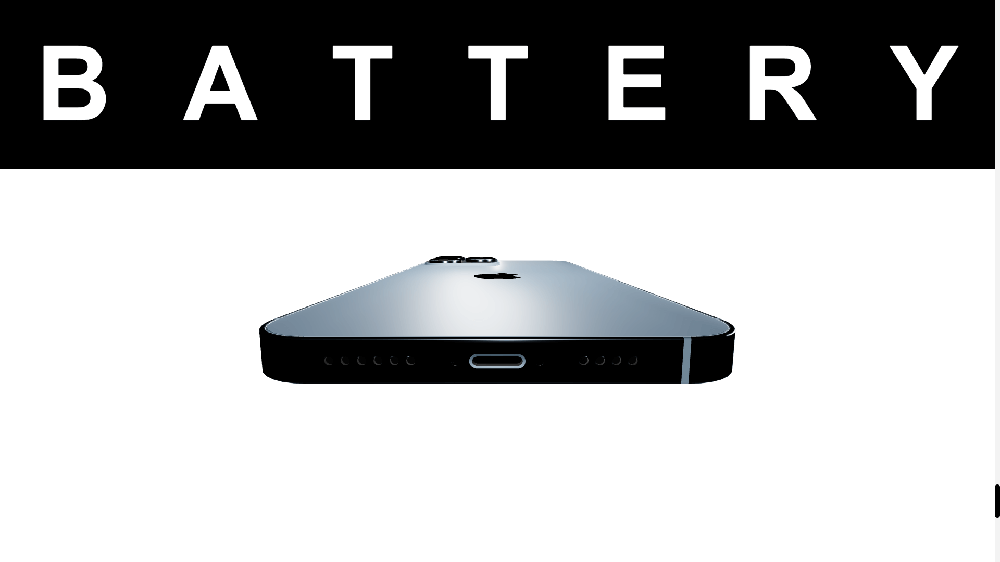

# IPhone 13 - Landing Page 📱

https://friendly-carson-a22302.netlify.app/

<br />

### About Project

It's a simple website for an IPhone 13, once I was learning react-three-fiber and this came out from my wings. The code is ugly and now, after this time, I know that most things could be done better. Right now I don't wanna waste my time on polishing this project 'cause I've gave up learning this library for now. It's just "pretty"!

<br />

## Used Technologies
* React - version 17.0.2
* Styled-components - version 5.3.1
* Three.js - version 0.122.0
* React-three-fiber - version 7.0.7
* React-intersection-observer - version 8.32.1

<br />

## Features

- Toggle between different IPhone colors and pretty much that's it. It's just a layout and most important part for me then was to learn something from react-three-fiber

<br />

## How to run?

1. Clone the project

```bash
  git clone https://github.com/BlackAndWhiteCarnage/IPhone13
```

2. Install dependencies

```bash
  npm install
```

3. Run project

```bash
  npm start
```

<br />

## Quick Preview

### Home Page


### Home Page Description


### Display


### Camera


### Battery


<br />

## Author

- [@BlackAndWhiteCarnage](https://github.com/BlackAndWhiteCarnage)
